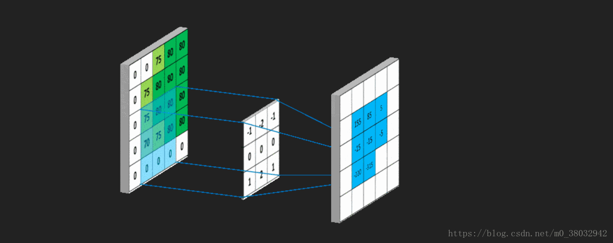
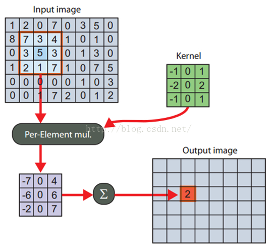
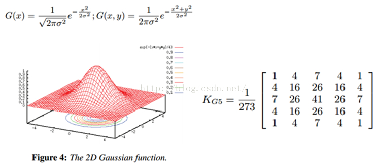
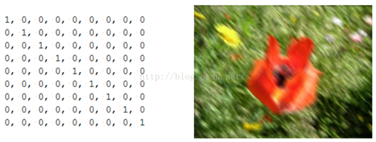

# 线性滤波  

在这次实验中，通过卷积核来对图像进行处理，也是得到了十分奇妙的效果，之前自己也一直接触ps，对于ps中的很多功能实现都十分惊奇，不过这次实验完成的图像的均值模糊、锐化、浮雕效果、边缘检测等效果都让我感到了卷积核这种实现算法的奇妙之处。   

## 关于卷积核  

##   

在之前的《信号与系统》课上便接触到了卷积的概念，也是一个十分重要的概念，当时讲到了连续函数和离散函数的卷积计算方法，其中也是牵扯到了许多微分积分的使用技巧。这次实验使用的卷积核概念相对就简单很多了，实现公式如下：  

$  {g(i,j)} =  \sum_{k}^{l}{  f(i+k,j+l)  * h(k,l) } $   

相对于这个公式，上面那个动图要形象好多。也可以从下图理解    



在滤波器的使用过程中，也有一些规则要求：

+ 滤波器的大小应该是奇数，这样它才有一个中心，例如3X3、5X5，或者7X7。 
+ 滤波器所有元素之和应该是1，这是为了保持滤波前后图像的亮度保持不变。
+ 如果滤波矩阵所有元素之和大于 1，那么滤波后的图像就会比原图像亮。反之，如果小于1，那么得到的图像就会变暗。
+ 对于滤波后的结构，可能会出现负数或者大于255的数值，对于这种情况，我们将他们直接截断至0和255之间即可。  

而通过不同的卷积核便能够实现不同的操作，在我的理解中，便是通过利用卷积核同时对某一像素点及其周围的像素点同时进行操作，这样便可以通过RGB像素值得到图像的变化，从而实现各种图像操作。  

### 图像锐化  

$$
\left[
\begin{matrix}
-1 & -1 & -1 \\
-1 & 9 & -1 \\
-1 & -1 & -1 
\end{matrix} \right]
$$

通过这样一个卷积核，将每一个像素点进行进一步突出，实际上是计算当前点和周围点的差别，然后将这个差别加到原来的位置上。emm实在不知道怎么去解释，不过能够理解吧~  


### 边缘检测  

$$
\left[
\begin{matrix}
-1/8 & -1/8 & -1/8 \\
-1/8 & 1 & -1/8 \\
-1/8 & -1/8 & -1/8 
\end{matrix} \right]
$$

图像的锐化和边缘检测很像，需要注意的是，这里矩阵的元素和是0，所以滤波后的图像会很暗，只有边缘的地方是有亮度的。  


### 浮雕  

$$
\left[
\begin{matrix}
-1 & -1 & 0 \\
-1 & 0 & 1 \\
-1 & 1 & 1 
\end{matrix} \right]
$$

浮雕滤波器可以给图像一种3D阴影的效果。将中心一边的像素减去另一边的像素，然后我们对结果图像加上128的偏移。这时候，像素值有可能是负数，我们将负数当成阴影，将正数当成光，图像大部分就变成灰色了。便可以实现浮雕的效果。


### 均值模糊  

$$
\left[
\begin{matrix}
0 & 0.2 & 0 \\
0.2 & 0.2 & 0.2 \\
0 & 0.2 & 0 
\end{matrix} \right]
$$

我们可以将当前像素和它的四邻域的像素一起取平均，然后再除以5，或者直接在滤波器的5个地方取0.2的值即可。

### 高斯模糊  

均值模糊很简单，但不是很平滑。高斯模糊就有这个优点，所以被广泛用在图像降噪上。特别是在边缘检测之前，都会用来移除细节。高斯滤波器是一个低通滤波器。

    

### 运动模糊  

运动模糊可以通过只在一个方向模糊达到，例如下面9x9的运动模糊滤波器。注意，求和结果要除以9。  



## 算法实现  

卷积核的大小一般为3 * 3或5 * 5，所以在这次实验中将卷积核定义为了一个类，从而更方便于数据处理和封装，类定义如下：

```c++
class kernel
{
public:
	float data[5][5];
	int kernelX, kernelY;
	int kCenterX, kCenterY;
	kernel(){}
	kernel(float arry[5][5], int row, int col, double a ) {	//a为参数，默认为1
		kernelX = row; kernelY = col;
		kCenterX = kernelX / 2;  kCenterY = kernelY / 2;
		for (int i = 0; i < kernelX; i++)
		{
			for (int j = 0; j < kernelY; j++)
			{
				data[i][j] = arry[i][j] * a;
			}
		}
	}
};
```

然后根据卷积核运算规则，进行矩阵运算，本次实验中直接使用四重循环实现，并没有使用加速算法，实现代码图下：

```c++
for (int k = 0; k < 3; k++)	//三个通道处理
{
	poSrcDS->GetRasterBand( k + 1)->RasterIO(GF_Read,
		0, 0, imgXlen, imgYlen, buffTmp, imgXlen, imgYlen, GDT_Byte, 0, 0);
	for (int i = 0; i < imgXlen; i++)
	{
		for (int j = 0; j < imgYlen; j++)	//逐像素处理
		{
			if (i < m_kernel.kCenterX || i > imgXlen - m_kernel.kCenterX
					|| j < m_kernel.kCenterY || j > imgYlen - m_kernel.kCenterY) {	//边界处理，直接置0
				buffTmp[i*imgXlen + j] = 0;
				continue;
			}
			float result = 0;	//卷积核运算结果
			for (int m = 0; m < m_kernel.kernelX; m++)
			{
				rowIndex = i + m - m_kernel.kCenterX;
				for (int n = 0; n < m_kernel.kernelY; n++)
				{
					colIndex = j + n - m_kernel.kCenterY;
					if (rowIndex >= 0 && rowIndex < imgXlen && colIndex >= 0 && colIndex < imgYlen)
						result += buffTmp[imgXlen * rowIndex + colIndex] * m_kernel.data[m][n];
				}
			}
			test[i*imgXlen + j] = result;
		}
	}
	poDstDS->GetRasterBand( k + 1)->RasterIO(GF_Write,
		0, 0, imgXlen, imgYlen, test, imgXlen, imgYlen, GDT_Byte, 0, 0);
	cout << " ... ... band " << k+1 << " processing ... ..." << endl;
}
```

在卷积核运算中比较麻烦处理的是矩阵相乘，代码中实现的是利用rowIndex和colIndex来实现行列的变换。


好好学习，天天向上~


老师给的作业要求：<a url=https://github.com/summitgao/SoftwareClass/blob/master/lesson_04.md>链接</a>  

 

