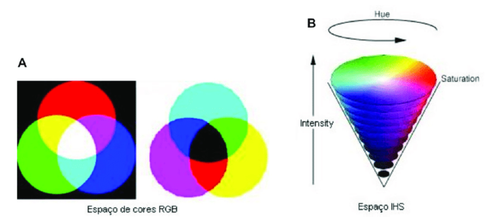
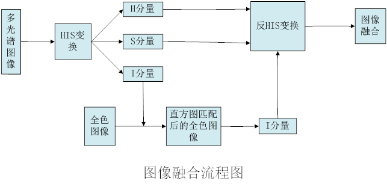
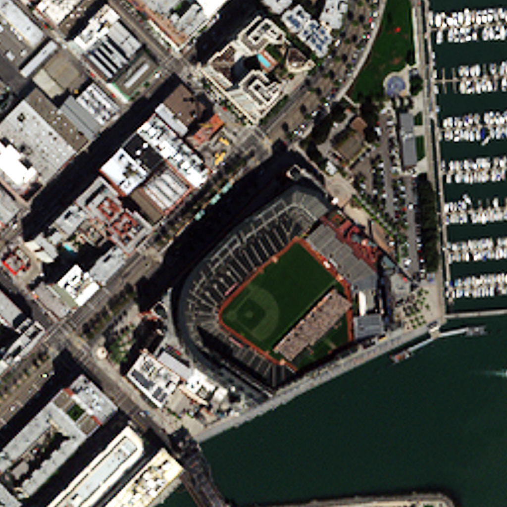
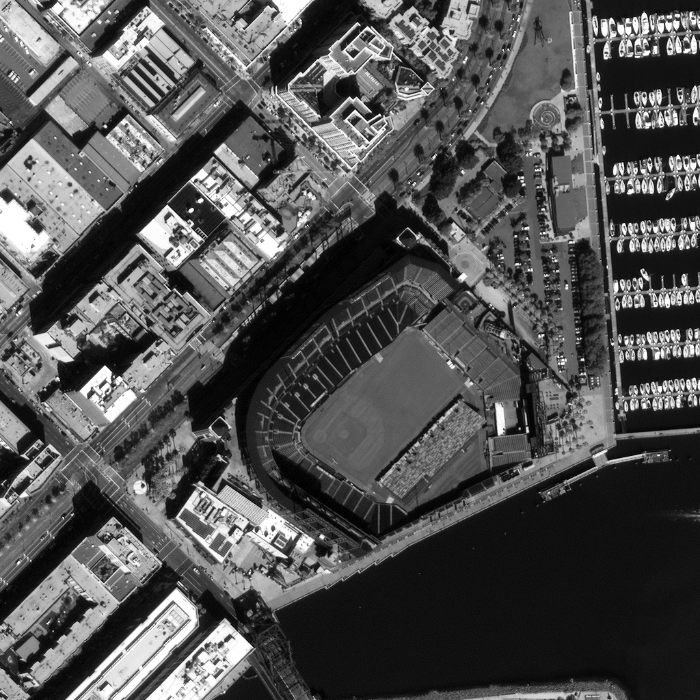

## IHS遥感图像融合  

本次实验是将RGB颜色进行转换，然后进行IHS变换，从而实现图像融合。   

## 颜色模型  

目前常用的颜色模型一种是RGB三原色模型，另外一种广泛采用的颜色模型是亮度、色调、饱和度（IHS颜色模型）。

> 所谓IHS彩色变换，是指将标准RGB图像有效地分离为代表变间信息的明度(I)和代表波谱信息的色调(H)、饱和度(S)。

亮度表示光谱的整体亮度大小，对应于图像的空间信息属性；

色调描述纯色的属性，决定于光谱的主波长，是光谱在质的方面的区别；

饱和度表征光谱的主波长在强度中的比例，色调和饱和度代表图像的光谱分辨率。

IHS变换图像融合就是建立在IHS空间模型的基础上，其基本思想就是在IHS空间中，将低空间分辨率的多光谱图像的亮度分量用高空间分辨率的灰度图象替换。





 

### 基本流程 

+ 将多光谱影像重采样到与全色影像具有相同的分辨率；
+ 将多光谱图像的Ｒ、Ｇ、Ｂ三个波段转换到IHS空间，得到Ｉ、Ｈ、Ｓ三个分量；
+ 以Ｉ分量为参考，对全色影像进行直方图匹配
+ 用全色影像替代Ｉ分量，然后同Ｈ、Ｓ分量一起逆变换到RGB空间，从而得到融合图像。

### 算法实现

首先我们定义变换矩阵。

```c++
// RGB ==> IHS 正变换矩阵
float tran1[3][3] = {
    {	1.0f / 3.0f,		1.0f / 3.0f,		1.0f / 3.0f			},
    {	-sqrt(2.0f) / 6.0f,	-sqrt(2.0f) / 6.0f,	sqrt(2.0f) / 3.0f	},
    {	1.0f / sqrt(2.0f),	-1.0f / sqrt(2.0f),	0				}
};
// IHS ==> RGB 逆变换矩阵
float tran2[3][3] = {
    {	1.0f,  -1.0f / sqrt(2.0f),	1.0f / sqrt(2.0f)	},
    {	1.0f,  -1.0f / sqrt(2.0f),	-1.0f / sqrt(2.0f)	},
    {	1.0f,  sqrt(2.0f),			0					}
};
```

在读取颜色通道的时候，因为全色图像只有一个颜色通道，所以只需要读取第一个通道的颜色即可。

```c++
// 读取颜色通道
for (int i = 0; i < 3; i++)
{	// 将多光谱图像的三个颜色通道保存到一个三维数组中，进行相应操作
    poSrcDS_MUL->GetRasterBand(i + 1)->RasterIO(GF_Read,
         0, 0, imgXlen, imgYlen, buffTmp_rgb[i], imgXlen, imgYlen, GDT_Float32, 0, 0);
}
poSrcDS_PAN->GetRasterBand(1)->RasterIO(GF_Read,
         0, 0, imgXlen, imgYlen, buffTmp_PAN, imgXlen, imgYlen, GDT_Float32, 0, 0);
```

对多光谱图像进行IHS正变换，利用矩阵相乘，将RGB三个波段转换到IHS空间，得到Ｉ、Ｈ、Ｓ三个分量。不过由于第一个R通道会被替换，所以这里可以直接跳过第一个颜色通道的计算。

```c++
// 进行 RGB ==> IHS 正变换
for (int i = 1; i < 3; i++)
{
    for (int j = 0; j < imgXlen*imgYlen; j++)
    {
        trans_res[i][j] = 0;
        for (int k = 0; k < 3; k++)
        {
            trans_res[i][j] += tran1[i][k] * buffTmp_rgb[k][j];
        }
    }
}
```

然后用全色图像的值替换第一个颜色通道，然后在进行逆变换便可以得到融合图像。

```c++
// 利用 PAN 替换 I 分量
for (int i = 0; i < imgXlen*imgYlen; i++)
{
    trans_res[0][i] = buffTmp_PAN[i];
}

// 进行 IHS ==> RGB 反变换
for (int i = 0; i < 3; i++)
{
    for (int j = 0; j < imgXlen*imgYlen; j++)
    {
        buffTmp_rgb[i][j] = 0;
        for (int k = 0; k < 3; k++)
        {
            buffTmp_rgb[i][j] += tran2[i][k] * trans_res[k][j];
        }
    }
}
```

### 实现效果

多光谱图像



全色图像



融合图像


### 个人小结

在本次实验中，由于一些小细节导致除了很多错误，然后也一直没有发现。最后还是老师帮忙找到的，所以以后一定要细心。

好好学习，天天向上~

 

