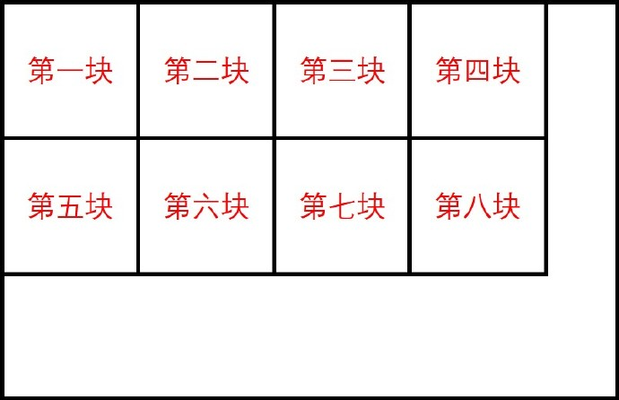
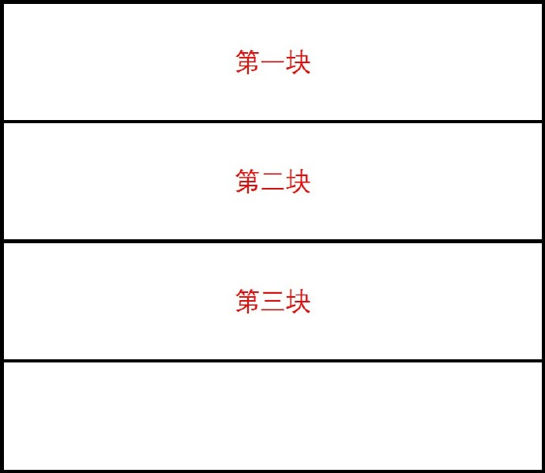

## 遥感图像的分块处理  

本次实验是在上次IHS遥感图像融合实验的基础上进行改进，对图像进行分块处理。其中原因主要是因为遥感图像的尺寸巨大（长宽可达30000像素以上），不可能开辟一个大内存把整个图像读进来。所以都是采用分块处理的方式进行的。

## 分块处理  

给出下面两种分块处理方式：

+ 使用矩形块（一般使用256 * 256或者512 * 512的块）

  

 

不过这种方法有一定的问题，就是在一个块中进行操作的时候，都是需要从这个块的首地址（最左上角的位置）开始，然后在这个块中一行一行进行操作的时候，**因为行是不连续的，所以在进行下一行的时候需要进行指针移动**！这样在对图像文件进行操作的时候，就会导致每次进行操作，需要进行大量文件指针的移动。如果是256*256，那么每一块的操作就需要进行256次指针移动，整幅图像就需要至少移动块数 * 256次文件指针，这样的磁盘I/O次数有点惊人。

+ 使用长方形块（256*imgXlen）

  

  如果使用这种分块方法，就可以大量减少指针移动，并且，代码逻辑也会好很多。每块只是行号变化，块的起始列位置都是0，不需要变化。同时因为每一块的每行数据在磁盘上都是连续的，因此**在读写时只需将文件指针定位到块的起始位置，就能实现整块的读写**。毫无疑问，这种分块方法比前一种分块方法磁盘I/O次数要少很多。

### 算法实现

这里给出上一次实验的链接，可以在上一次的实验中查看一些基础实现方法。本次实验的图像处理部分仍是借鉴上次实验的处理方法， 然后增添图像分块操作。

上一次实验：[实验五](https://github.com/hyzs1220/Software-Engineering/tree/master/exp5)

`256*256矩形分块`

```c++
// 使用256 * 256 大小的块对图像进行处理	N=256 
//分配内存
buffTmp_PAN = (float*)CPLMalloc(N*N * sizeof(float));
for (int i = 0; i < 3; i++)
{
    buffTmp_rgb[i] = (float*)CPLMalloc(N*N * sizeof(float));
    trans_res[i] = (float*)CPLMalloc(N*N * sizeof(float));
}

// 相关变量
int blockX_num = (imgXlen - 1) / N + 1;	// 块数
int blockY_num = (imgYlen - 1) / N + 1;
int blockX_len = N, blockY_len = N;	// 当前处理块的长宽
int img_x, img_y;	// 当前处理位置

for (int i = 0; i < blockY_num; i++)
{
    for (int j = 0; j < blockX_num; j++)
    {
        blockX_len = N;
        blockY_len = N;
        // 边块处理，对于正好分割的图形也试用，学一手
        if (i == blockY_num - 1) {	//最低侧的边块
            blockY_len = (imgYlen - 1) % N + 1;
        }
        if (j == blockX_num - 1) {	//最右侧的边块
            blockX_len = (imgXlen - 1) % N + 1;
        }

        img_x = j * N;
        img_y = i * N;

        // 读取颜色通道
        for (int k = 0; k < 3; k++)
        {
            poSrcDS_MUL->GetRasterBand(k + 1)->RasterIO(GF_Read,
                                                        img_x, img_y, blockX_len, blockY_len, buffTmp_rgb[k], blockX_len, blockY_len, GDT_Float32, 0, 0);

        }
        poSrcDS_PAN->GetRasterBand(1)->RasterIO(GF_Read,
                                                img_x, img_y, blockX_len, blockY_len, buffTmp_PAN, blockX_len, blockY_len, GDT_Float32, 0, 0);

        // 进行 RGB ==> IHS 正变换
        for (int m = 1; m < 3; m++)
        {
            for (int n = 0; n < blockX_len*blockY_len; n++)
            {
                trans_res[m][n] = 0;
                for (int k = 0; k < 3; k++)
                {
                    trans_res[m][n] += tran1[m][k] * buffTmp_rgb[k][n];
                }
            }
        }

        // 利用 PAN 替换 I 分量
        for (int k = 0; k < blockX_len*blockY_len; k++)
        {
            trans_res[0][k] = buffTmp_PAN[k];
        }

        // 进行 RGB ==> IHS 反变换
        for (int m = 1; m < 3; m++)
        {
            for (int n = 0; n < blockX_len*blockY_len; n++)
            {
                buffTmp_rgb[m][n] = 0;
                for (int k = 0; k < 3; k++)
                {
                    buffTmp_rgb[m][n] += tran2[m][k] * trans_res[k][n];
                }
            }
        }

        for (int k = 0; k < 3; k++)
        {
            poDstDS->GetRasterBand(k + 1)->RasterIO(GF_Write,
                                                    img_x, img_y, blockX_len, blockY_len, buffTmp_rgb[k], blockX_len, blockY_len, GDT_Float32, 0, 0);
        }

        cout << " ... ... block " << i * blockX_num + j + 1 << " processing ... ..." << endl;
    }
}
//清除内存
CPLFree(buffTmp_PAN);
for (int i = 0; i < 3; i++)
{
    CPLFree(buffTmp_rgb[i]);
    CPLFree(trans_res[i]);
}
```

`256*imgXlen长方形分块`

```c++
// 使用256 * imgXlen 大小的块对图像进行处理
//分配内存
buffTmp_PAN = (float*)CPLMalloc(N*imgXlen * sizeof(float));
for (int i = 0; i < 3; i++)
{
    buffTmp_rgb[i] = (float*)CPLMalloc(N*imgXlen * sizeof(float));
    trans_res[i] = (float*)CPLMalloc(N*imgXlen * sizeof(float));
}

// 相关变量
int blockY_num = (imgYlen - 1) / N + 1;
int blockY_len = N;	// 当前处理块的宽
int img_y;	// 当前处理位置

for (int i = 0; i < blockY_num; i++)
{

    blockY_len = N;
    // 边块处理，对于正好分割的图形也试用，学一手
    if (i == blockY_num - 1) {	//最低侧的边块
        blockY_len = (imgYlen - 1) % N + 1;
    }

    img_y = i * N;

    // 读取颜色通道
    for (int k = 0; k < 3; k++)
    {
        poSrcDS_MUL->GetRasterBand(k + 1)->RasterIO(GF_Read,
                                                    0, img_y, imgXlen, blockY_len, buffTmp_rgb[k], imgXlen, blockY_len, GDT_Float32, 0, 0);
    }
    poSrcDS_PAN->GetRasterBand(1)->RasterIO(GF_Read, 
                                            0, img_y, imgXlen, blockY_len, buffTmp_PAN, imgXlen, blockY_len, GDT_Float32, 0, 0);

    // 进行 RGB ==> IHS 正变换
    for (int m = 1; m < 3; m++)
    {
        for (int n = 0; n < imgXlen*blockY_len; n++)
        {
            trans_res[m][n] = 0;
            for (int k = 0; k < 3; k++)
            {
                trans_res[m][n] += tran1[m][k] * buffTmp_rgb[k][n];
            }
        }
    }

    // 利用 PAN 替换 I 分量
    for (int k = 0; k < imgXlen*blockY_len; k++)
    {
        trans_res[0][k] = buffTmp_PAN[k];
    }

    // 进行 RGB ==> IHS 反变换
    for (int m = 1; m < 3; m++)
    {
        for (int n = 0; n < imgXlen*blockY_len; n++)
        {
            buffTmp_rgb[m][n] = 0;
            for (int k = 0; k < 3; k++)
            {
                buffTmp_rgb[m][n] += tran2[m][k] * trans_res[k][n];
            }
        }
    }

    for (int k = 0; k < 3; k++)
    {
        poDstDS->GetRasterBand(k + 1)->RasterIO(GF_Write,
                                                0, img_y, imgXlen, blockY_len, buffTmp_rgb[k], imgXlen, blockY_len, GDT_Float32, 0, 0);
    }

    cout << " ... ... block " << i + 1 << " processing ... ..." << endl;
}
//清除内存
CPLFree(buffTmp_PAN);
for (int i = 0; i < 3; i++)
{
    CPLFree(buffTmp_rgb[i]);
    CPLFree(trans_res[i]);
}
```

### 实现效果

图像太大，五百多兆，所以就不上传了。。。

### 算法效率

+ 矩形分块

  这个真的是让我等了好久好久。在处理的过程中一直输出当前处理的分块号，然后这个需要1900多个分块的处理，然后就一直输出，过程中还会停顿一会儿，虽然没有计时，但是真的好慢。。。。然后辛亏没有什么bug。不然这个调试起来也是很麻烦。

+ 长方形分块

  这个也不是很快，不过也因为图像过大的原因，但比上面那么快很多了。

### 学习心得

在本次实验中也是学习了一个技巧，用来处理图像边界部分不足以进行全部分块的部分。

```c++
// 相关变量
int blockX_num = (imgXlen - 1) / N + 1;	// 块数
int blockY_num = (imgYlen - 1) / N + 1;
int blockX_len = N, blockY_len = N;	// 当前处理块的长宽
int img_x, img_y;	// 当前处理位置

for (int i = 0; i < blockY_num; i++)
{
    for (int j = 0; j < blockX_num; j++)
    {
        blockX_len = N;
        blockY_len = N;
        // 边块处理，对于正好分割的图形也试用，学一手
        if (i == blockY_num - 1) {	//最低侧的边块
            blockY_len = (imgYlen - 1) % N + 1;
        }
        if (j == blockX_num - 1) {	//最右侧的边块
            blockX_len = (imgXlen - 1) % N + 1;
        }

        img_x = j * N;
        img_y = i * N;
```

部分代码如上。主要部分是 `blockX_num = (imgXlen - 1) / N + 1; `和  `blockX_len = (imgXlen - 1) % N + 1;` 这两部分。这样就能够很好的解决边界部分。

好好学习，天天向上~

 

