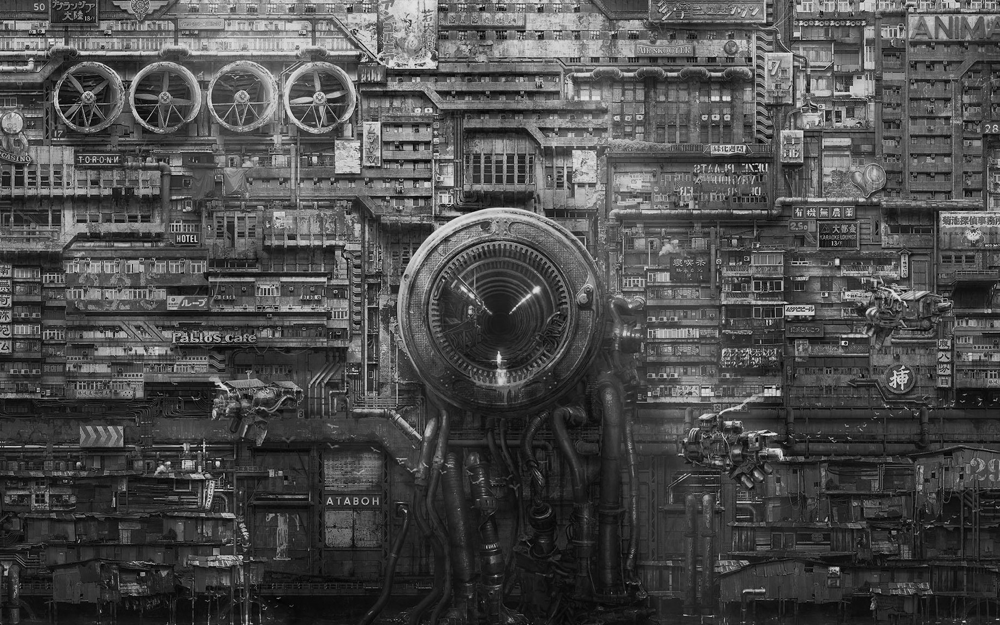
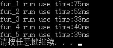

## 加速处理  

今天在刷知乎的时候看到了一个很有意思的回答，附上[链接](https://www.zhihu.com/question/287421003/answer/528275532?utm_source=qq&utm_medium=social&utm_oi=779246599611113472)。

因为最近也在学习这一部分内容，所以也自己动手尝试了一下，速度确实会快一些，也有可能是电脑进步太快的原因吧，图像处理的时候也并没有花费很多时间。emm也有可能是编译器自动帮忙优化了吧。。不过也确实学到了很多，尤其是将浮点数运算转换整数运算的时候是能够明显看到速度提升的。

因为不牵扯很多内容，所以这里就直接贴出代码吧。

### 普通处理

```c++
int fun_1(int imgX, int imgY, GByte* buffTmp_rgb[3], GDALDataset* poDstDS)
{
	float* resultBuff[3];

	//根据图像的宽度和高度分配内存
	for (int i = 0; i < 3; i++)
	{
		resultBuff[i] = (float*)CPLMalloc(imgX*imgY * sizeof(float));
	}

	start = clock();
	// RGB处理
	for (int k = 0; k < 3; k++)
	{
		for (int i = 0; i < imgX*imgY; i++)
		{
			resultBuff[k][i] = 0.299*buffTmp_rgb[0][i] + 0.587*buffTmp_rgb[1][i] + 0.114*buffTmp_rgb[2][i];
		}
	}
	finish = clock();
	double endtime = (double)(finish - start) / CLOCKS_PER_SEC;
	cout << "fun_1 run use time:" << endtime * 1000 << "ms" << endl;	//ms为单位

	// 写入
	for (int i = 0; i < 3; i++)
	{
		poDstDS->GetRasterBand(i+1)->RasterIO(GF_Write,
			0, 0, imgX, imgY, resultBuff[i], imgX, imgY, GDT_Float32, 0, 0);
	}
	
	return 1;
}
```

### 去除浮点数运算，改用整形运算

```c++
int fun_2(int imgX, int imgY, GByte* buffTmp_rgb[3], GDALDataset* poDstDS)
{
	float* resultBuff[3];

	//根据图像的宽度和高度分配内存
	for (int i = 0; i < 3; i++)
	{
		resultBuff[i] = (float*)CPLMalloc(imgX*imgY * sizeof(float));
	}

	// RGB处理
	start = clock();
	for (int k = 0; k < 3; k++)
	{
		for (int i = 0; i < imgX*imgY; i++)
		{
			resultBuff[k][i] = (299 * buffTmp_rgb[0][i] + 587 * buffTmp_rgb[1][i] + 114 * buffTmp_rgb[2][i]) / 1000;
		}
	}
	finish = clock();
	double endtime = (double)(finish - start) / CLOCKS_PER_SEC;
	cout << "fun_2 run use time:" << endtime * 1000 << "ms" << endl;	//ms为单位

	// 写入
	for (int i = 0; i < 3; i++)
	{
		poDstDS->GetRasterBand(i + 1)->RasterIO(GF_Write,
			0, 0, imgX, imgY, resultBuff[i], imgX, imgY, GDT_Float32, 0, 0);
	}


	return 1;
}
```

### 进一步优化，用移位操作代替除法

```c++
int fun_3(int imgX, int imgY, GByte* buffTmp_rgb[3], GDALDataset* poDstDS)
{
	float* resultBuff[3];

	//根据图像的宽度和高度分配内存
	for (int i = 0; i < 3; i++)
	{
		resultBuff[i] = (float*)CPLMalloc(imgX*imgY * sizeof(float));
	}

	// RGB处理
	start = clock();
	for (int k = 0; k < 3; k++)
	{
		for (int i = 0; i < imgX*imgY; i++)
		{
			resultBuff[k][i] = (1224 * buffTmp_rgb[0][i] + 2404 * buffTmp_rgb[1][i] + 467 * buffTmp_rgb[2][i]) >> 12;
		}
	}
	finish = clock();
	double endtime = (double)(finish - start) / CLOCKS_PER_SEC;
	cout << "fun_3 run use time:" << endtime * 1000 << "ms" << endl;	//ms为单位

	// 写入
	for (int i = 0; i < 3; i++)
	{
		poDstDS->GetRasterBand(i + 1)->RasterIO(GF_Write,
			0, 0, imgX, imgY, resultBuff[i], imgX, imgY, GDT_Float32, 0, 0);
	}

	return 1;
}
```

### 使用查表数组

因为RGB进行变化后的值是确定的，在一定的范围内，所以我们可以将这些所有可能值先进行一次计算，然后再读取图像的RGB值之后，就可以直接从数组中查找到相应的值。当像素点十分庞大时便更加有效。

```c++
void arry_inite(float D[256], float E[256], float F[256])
{
	for (int i = 0; i < 256; i++)
	{
		D[i] = (i * 1224) >> 12;
		E[i] = (i * 2404) >> 12;
		F[i] = (i * 467) >> 12;
	}
}

int fun_4(int imgX, int imgY, GByte* buffTmp_rgb[3], GDALDataset* poDstDS)
{
	float D[256], E[256], F[256];
	float* resultBuff[3];
	arry_inite(D, E, F);

	//根据图像的宽度和高度分配内存
	for (int i = 0; i < 3; i++)
	{
		resultBuff[i] = (float*)CPLMalloc(imgX*imgY * sizeof(float));
	}

	// RGB处理
	start = clock();
	for (int k = 0; k < 3; k++)
	{
		for (int i = 0; i < imgX*imgY; i++)
		{
			resultBuff[k][i] = D[buffTmp_rgb[0][i]] + D[buffTmp_rgb[1][i]] + D[buffTmp_rgb[2][i]];
		}
	}
	finish = clock();
	double endtime = (double)(finish - start) / CLOCKS_PER_SEC;
	cout << "fun_4 run use time:" << endtime * 1000 << "ms" << endl;	//ms为单位

	// 写入
	for (int i = 0; i < 3; i++)
	{
		poDstDS->GetRasterBand(i + 1)->RasterIO(GF_Write,
			0, 0, imgX, imgY, resultBuff[i], imgX, imgY, GDT_Float32, 0, 0);
	}

	return 1;
}
```

### 进一步优化，使用并行计算

这里的并行计算并不是很理解，可能会牵扯到编译器的实现原理吧。

```c++
int fun_5(int imgX, int imgY, GByte* buffTmp_rgb[3], GDALDataset* poDstDS)
{
	float D[256], E[256], F[256];
	float* resultBuff[3];
	arry_inite(D, E, F);

	//根据图像的宽度和高度分配内存
	for (int i = 0; i < 3; i++)
	{
		resultBuff[i] = (float*)CPLMalloc(imgX*imgY * sizeof(float));
	}

	// RGB处理
	start = clock();
	for (int k = 0; k < 3; k++)
	{
		for (int i = 0; i < imgX*imgY; i += 2)
		{
			resultBuff[k][i] = D[buffTmp_rgb[0][i]] + D[buffTmp_rgb[1][i]] + D[buffTmp_rgb[2][i]];
			resultBuff[k][i + 1] = D[buffTmp_rgb[0][i + 1]] + D[buffTmp_rgb[1][i + 1]] + D[buffTmp_rgb[2][i + 1]];
		}
	}
	finish = clock();
	double endtime = (double)(finish - start) / CLOCKS_PER_SEC;
	cout << "fun_5 run use time:" << endtime * 1000 << "ms" << endl;	//ms为单位

	// 写入
	for (int i = 0; i < 3; i++)
	{
		poDstDS->GetRasterBand(i + 1)->RasterIO(GF_Write,
			0, 0, imgX, imgY, resultBuff[i], imgX, imgY, GDT_Float32, 0, 0);
	}

	return 1;
}
```

### 实现效果

具体实现功能是将图像黑白化。





运行时间如下：



好好学习，天天向上~

 

